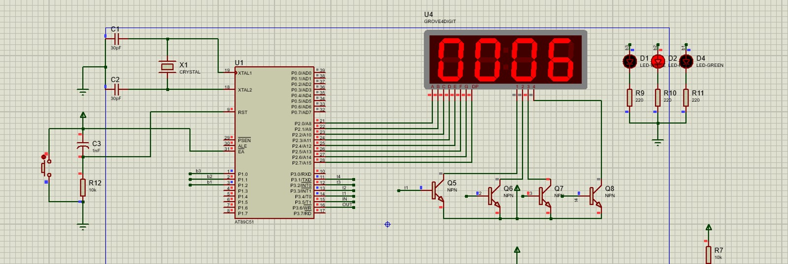

# 8051 People Counting System

This repository contains the source code and documentation for a **People Counting System** built using the 8051 microcontroller and photoresistor (or laser sensor for greater range). The system counts people entering and exiting a room and displays the count on a 7-segment LED display. The system also includes LEDs to indicate occupancy levels (low, medium, high).

## Features
- **Photoresistor** detect people entering and exiting a room.
- **7-segment LED display** shows real-time count of people in the room.
- **Occupancy indicator LEDs**: Green for low occupancy (1-4), red for medium (5-9), and white for high occupancy (10+).
- Simulated in **Proteus** and programmed using **Keil uVision**.

## Getting Started

### Prerequisites
To run this project, you'll need:
- **Proteus**: For circuit simulation.
- **Keil uVision**: To compile and generate the HEX file for the 8051 microcontroller.

### Instructions

#### 1. Creating the Proteus Project
1. Open **Proteus** and create a new project.
2. Refer to the schematic diagram located at `/docs/schematics.png`. Rebuild the circuit in Proteus using components such as:
   - 8051 Microcontroller (AT89C51)
   - Two Photoresistors (for IN and OUT detection)
   - 7-Segment LED Display
   - Resistors, capacitors, LM7805 voltage regulator, LEDs.
   
   

#### 2. Setting up Keil uVision Project
1. Open **Keil uVision** and create a new project.
2. Select **8051 Microcontroller** (AT89C51).
3. Set the crystal frequency to **12MHz** in the project settings.
4. Add the provided C code from the `/code/source_code.c` file.
5. Compile the project to generate the `hex_file.hex`.

#### 3. Configuring Proteus for the HEX File
1. In **Proteus**, set the crystal frequency of the 8051 microcontroller to **12MHz**.
2. Load the `hex_file.hex` into the 8051 microcontroller:
   - Double-click the 8051 component in Proteus.
   - Under **Program File**, browse and select the `hex_file.hex` file generated from Keil.
3. Make sure all the connections are correct and the circuit is fully assembled.

#### 4. Running the Simulation
After setting up the circuit and loading the HEX file, you can run the simulation in **Proteus**.

### How to Simulate People Entering and Exiting

#### Simulating a Person Entering the Room:
1. Move the light source away from the **IN sensor**, followed by the **OUT sensor** to simulate a person entering the room.  
   - The **D3** and **D5** LEDs will light up, indicating that the sensors have detected the person blocking the light.  
   
   

2. Once the light sources are returned to normal, the system will count the person as having entered the room, and the **7-segment display** will increment by 1.  
   - The **green LED** will light up if the total count is less than 5.  
   
   

#### Simulating a Person Exiting the Room:
1. Move the light source away from the **OUT sensor**, followed by the **IN sensor** to simulate a person exiting the room.  
   
   

2. After returning the light sources to normal, the system will count the person as having exited, and the **7-segment display** will decrement by 1.  

   

#### Occupancy Indicator LEDs:
- **Green LED**: Lights up when there are fewer than 5 people in the room.
- **Red LED**: Lights up when the room occupancy is between 5 and 9 people.  
   
   

- **White LED**: Lights up when the room occupancy reaches or exceeds 10 people.  
   
   

## Demo Screenshots
- The overall project: 
- Power supply: 
- Simulating person entering: 
- Simulating person exiting: 
- Medium occupancy: 
- High occupancy: 

## License
This project is licensed under the MIT License. See the LICENSE file for more details.
